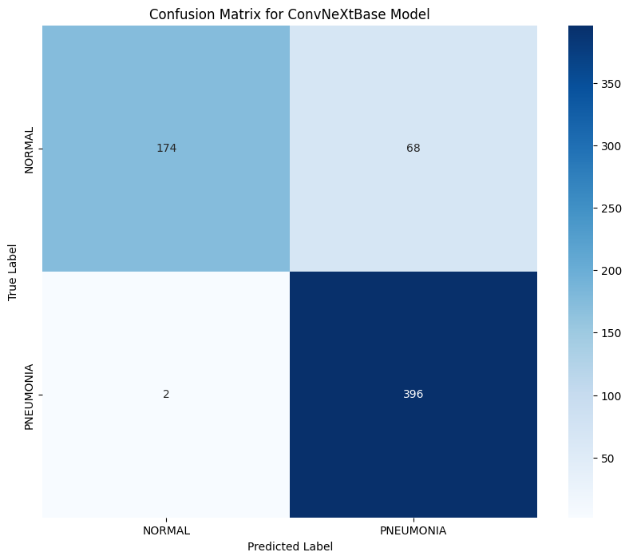
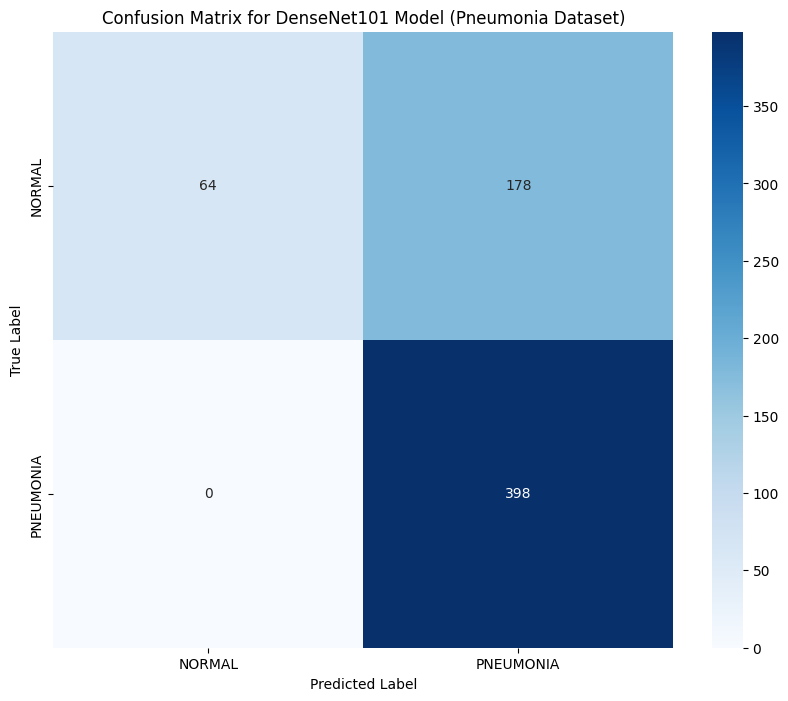
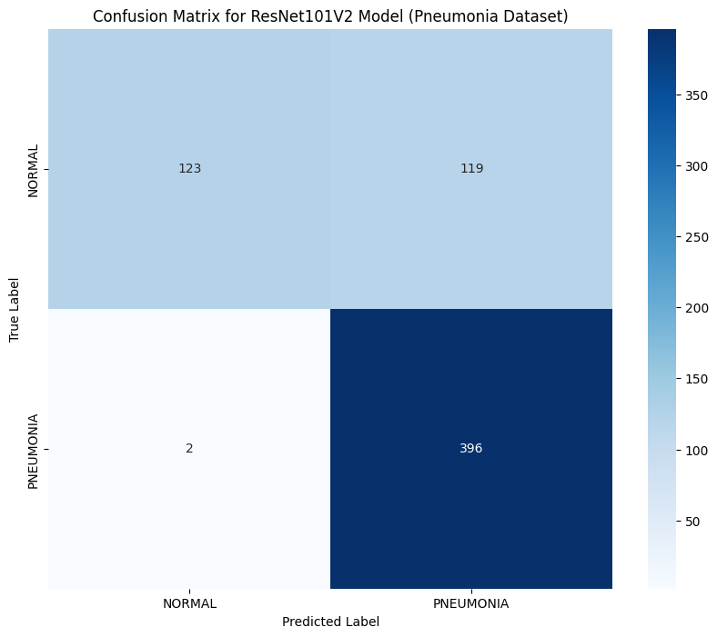
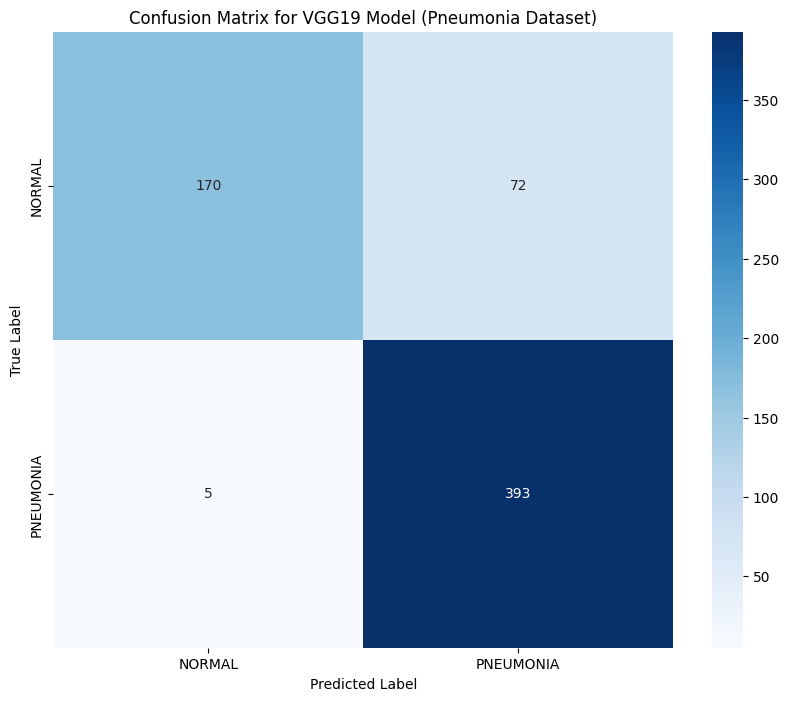

# 🩺 Pneumonia Detection from CXR using Transfer Learning Models
<p align="left">
  
  
  
  
  
  
  
  
  
  
  
</p>


## 📌 Project Overview
This project focuses on developing a deep learning-based system to automatically detect Pneumonia from chest X-ray images. Recognizing the critical importance of early diagnosis in respiratory diseases, especially pneumonia, this project compares the performance of five state-of-the-art convolutional neural network (CNN) architectures to identify the most effective model for accurate detection.

The following models were tested and evaluated:

`DenseNet121` `ConvNeXtBase` `ResNet50V2` `ResNet101V2` `VGG16`

Each model was trained and validated on a labeled dataset of chest X-ray images, designed to distinguish between Normal and Pneumonia-infected cases. By experimenting with multiple architectures, the goal is to identify the most accurate and reliable model for real-world deployment in clinical decision support systems.

The project emphasizes:

- Comparative analysis of model performance
- Evaluation based on accuracy, precision, recall, and F1-score
- Clean codebase with individual notebooks for each model under the src/ directory

The outcome provides valuable insights into the effectiveness of different CNN architectures for medical imaging tasks, specifically pneumonia detection.

## 📂 Dataset

The dataset sourced from Kaggle. To access it click [Chest X-Ray Images (Pneumonia)](https://www.kaggle.com/datasets/paultimothymooney/chest-xray-pneumonia?raw=true). Due to the large size, it is **not included in this repository**.

The dataset is organized into three folders: train, test, and validation. Each folder contains subfolders for two image categories: Pneumonia and Normal. In total, there are 5,863 chest X-ray images in JPEG format classified into these two categories. The image distribution of the dataset is as follows:


The chest X-ray images, taken from retrospective cohorts of pediatric patients aged one to five years, were sourced from the Guangzhou Women and Children’s Medical Center in Guangzhou. All imaging was conducted as part of the patients’ routine clinical care.

For the analysis of the chest X-ray images, the initial screening involved quality control, during which all low-quality or unreadable scans were removed. After this, two expert physicians graded the diagnoses for the images before they were approved for training the AI system. To account for any potential grading errors, a third expert reviewed the evaluation set.


## 📁 Project Structure

```bash
📂 Pneumonia-Detection-Project/
├── 📁 src/
│   ├── 📓 ConvNeXtBase_Pneumonia.ipynb
│   ├── 📓 DenseNet121_Pneumonia.ipynb
│   ├── 📓 ResNet50V2_Pneumonia.ipynb
│   ├── 📓 ResNet101V2_Pneumonia.ipynb
│   └── 📓 VGG16_Pneumonia.ipynb
│
├── 📁 data/                     # Dataset not uploaded in repository due to large size
├── 📁 outputs/                  # Results and Visualizations
│
├── 📄 requirements.txt
├── 📄 README.md
└── 📄 LICENCE
```
## 🧾 Requirements

`Python 3.x` `TensorFlow` `Keras` `Matplotlib` `Numpy` `Scikit-learn`

## 🧪 Experiments

In this project, five deep learning models were systematically evaluated on the pneumonia chest X-ray dataset to assess their performance in binary classification. All models were trained for 30 epochs using the ImageDataGenerator for real-time data augmentation and mixed precision training to optimize GPU usage and accelerate computation. The ConvNeXtBase model, comprising 88.6 million parameters, was trained using the Adam optimizer with a learning rate of 0.001, a batch size of 256, and a dense layer of 1204 units. DenseNet121, with 7.5 million parameters, utilized the same optimizer and learning rate but with a larger batch size of 512 and a 512-unit dense layer. ResNet50V2 and ResNet101V2 models shared the same hyperparameters—learning rate of 0.0001, batch size of 512, and 512-unit dense layer—but differed in complexity, with 24.5 million and 43.5 million parameters respectively. VGG16, consisting of 15.2 million parameters, was also trained with a batch size of 512 and a learning rate of 0.001. All models employed categorical cross-entropy as the loss function and incorporated class weighting to mitigate the impact of dataset imbalance, ensuring more robust learning across both classes. Each experiment was conducted on an NVIDIA A100 GPU with 40GB memory, using input images resized to 224×224 pixels; although this facilitated efficient model training, the relatively low resolution of the inputs meant some loss of diagnostic detail was inevitable.

## 📊 Model Performance Comparison

| Model          | Accuracy | F1 Score | Loss   | Precision | Recall  |
|----------------|----------|----------|--------|-----------|---------|
| ConvNeXtBase   | 0.9705   | 0.9544   | 0.0747 | 0.9705    | 0.9705  |
| DenseNet121    | 0.9086   | 0.9285   | 0.3432 | 0.9086    | 0.9086  |
| ResNet50V2     | 0.9537   | 0.9459   | 0.1723 | 0.9537    | 0.9537  |
| ResNet101V2    | 0.9595   | 0.9356   | 0.1784 | 0.9595    | 0.9595  |
| VGG16          | 0.9595   | 0.9192   | 0.1030 | 0.9595    | 0.9595  |

ConvNeXtBase outperforms the others with the highest accuracy and F1 score, indicating strong generalization and precise predictions. DenseNet121 performs well but slightly trails behind ConvNeXtBase, with a good balance between precision and recall. ResNet50V2 offers a strong performance with high precision and recall, making it a reliable choice for detecting pneumonia. ResNet101V2 shows similar performance to ResNet50V2 but with slightly higher accuracy and a better F1 score. VGG16 offers solid results, although it performs slightly lower compared to the other models.

These results demonstrate that while all models perform well, ConvNeXtBase is the top performer for this task.
## 🧩 Confusion Matrices
Confusion Matrix of all 5 tests are included here. Click images for enlarged view.

<p align="left">
  
  
  
  
  
</p>

ConvNeXtBase and VGG16 exhibit more balanced results in comparison to the other models. These models show a better trade-off between correctly identifying 'Pneumonia' cases (True Positives) and minimizing misclassifications (False Positives and False Negatives). DenseNet121, ResNet50V2, and ResNet101V2 demonstrated some imbalance, with either a higher number of False Negatives or False Positives. While these models performed well overall, their results showed a tendency to misclassify 'Pneumonia' cases more frequently than ConvNeXtBase and VGG16. This indicates that ConvNeXtBase and VGG16 have achieved a more reliable and consistent classification performance, making them preferable for deployment in real-world scenarios where accuracy and balanced performance are crucial.

## 🔥 Grad-CAM Visualizations

Due to constraints in computational resources and available model options, training had to be conducted using lower-resolution images. As a result, some degree of misclassification and attention to less relevant regions in the images was anticipated. Some Grad-CAM visualizations are included in this section. Click images for enlarged view.


The first Grad-CAM visualization from the VGG16 model highlights the regions of the chest X-ray image that were most influential in the model's classification decision. In the heatmap on the right, warmer colors such as red and yellow indicate areas of high importance, while cooler colors like blue show regions of lower relevance. For this particular image, which is correctly classified as "NORMAL," the model focuses its attention primarily around the upper thoracic region, including the trachea, upper ribs, and clavicles. This pattern suggests that the model is evaluating the symmetry and clarity of lung fields and the absence of opacities or consolidations typically associated with pneumonia. The highlighted regions align well with typical diagnostic cues used by radiologists, indicating that the model is not only accurate but also interpretable in terms of clinical reasoning.


The second Grad-CAM visualization from the ConvNeXtBase model provides insight into how the network interprets and identifies features indicative of pneumonia in pediatric chest X-rays. In this correctly classified case of pneumonia, the heatmap shows intense activation—represented by red and yellow regions—primarily in the lower and peripheral zones of both lungs, particularly on the left side of the image, which correlates with areas where pathological features such as infiltrates or consolidations typically appear. The focus of the model on these asymmetric and dense regions suggests that it has learned to distinguish abnormal pulmonary patterns associated with infection. The visual explanation closely aligns with clinical expectations, demonstrating that the model not only achieves accurate predictions but does so by relying on diagnostically relevant anatomical features.


The last Grad-CAM visualization from the ResNet50V2 model reveals a misclassification, where a normal chest X-ray was incorrectly predicted as pneumonia. The heatmap indicates concentrated activation in the central and lower lung region, particularly over the cardiac silhouette, with intense red and yellow hues suggesting high model attention. This misinterpretation might stem from overlapping anatomical structures such as the heart and diaphragm, which can occasionally mimic pathological patterns in frontal radiographs. The model’s focus on this central area, despite the absence of infiltrates or asymmetry typically seen in pneumonia, suggests a limitation in its ability to differentiate normal anatomical density from disease-related opacities. This example highlights the importance of interpretability in deep learning models, as visual tools like Grad-CAM can help uncover potential biases or areas where the model may be overfitting to irrelevant or misleading features.

For more model specific visualizations, please refer to .ipynb files.

<a href="https://github.com/ShaikhBorhanUddin/Pneumonia-Detection-Project/blob/main/src/Pneumonia_ConvNeXtBase.ipynb" style="text-decoration: none; margin-right: 8px;">
  <code style="padding: 4px 8px; border-radius: 6px; background: #2d2d2d; color: white;">ConvNeXtBase_Pneumonia.ipynb</code>
</a>
<a href="https://github.com/ShaikhBorhanUddin/Pneumonia-Detection-Project/blob/main/src/Pneumonia_DenseNet121.ipynb" style="text-decoration: none; margin-right: 8px;">
  <code style="padding: 4px 8px; border-radius: 6px; background: #2d2d2d; color: white;">DenseNet121_Pneumonia.ipynb</code>
</a>
<a href="https://github.com/ShaikhBorhanUddin/Pneumonia-Detection-Project/blob/main/src/Pneumonia_ResNet50V2.ipynb" style="text-decoration: none; margin-right: 8px;">
  <code style="padding: 4px 8px; border-radius: 6px; background: #2d2d2d; color: white;">ResNet50V2_Pneumonia.ipynb</code>
</a>
<a href="https://github.com/ShaikhBorhanUddin/Pneumonia-Detection-Project/blob/main/src/Pneumonia_ResNet101V2.ipynb" style="text-decoration: none; margin-right: 8px;">
  <code style="padding: 4px 8px; border-radius: 6px; background: #2d2d2d; color: white;">ResNet101V2_Pneumonia.ipynb</code>
</a>
<a href="https://github.com/ShaikhBorhanUddin/Pneumonia-Detection-Project/blob/main/src/Pneumonia_VGG16.ipynb" style="text-decoration: none;">
  <code style="padding: 4px 8px; border-radius: 6px; background: #2d2d2d; color: white;">VGG16_Pneumonia.ipynb</code>
</a>

## 🚀 Future Development
As future development, the project aims to address dataset imbalance by incorporating more balanced datasets and advanced augmentation techniques, alongside exploring synthetic data generation methods like GANs to enrich the minority class. Model improvements will focus on experimenting with advanced architectures such as EfficientNet or Vision Transformers, fine-tuning hyperparameters, and integrating explainability tools like Grad-CAM++ for deeper insights into model predictions. Additionally, plans include enhancing evaluation with metrics like AUC-ROC and precision-recall curves, implementing experiment tracking tools such as MLflow, and deploying the model as an interactive web application for real-time inference. Collaborations with medical experts for clinical validation are also envisioned to ensure the model's practical relevance and reliability.


## 🤝 Contributing 
Contributions are welcome!
Feel free to fork the project and submit a pull request.

## 📄 License
This project is licensed under the MIT License - see the LICENSE file for details.

## 🙌 Acknowledgements
- ```Paul Mooney``` for the dataset
- TensorFlow / Keras community
- Medical professionals contributing to open datasets

## 🌟 Let's Connect!
If you like this project, please give it a ⭐!
Feel free to connect with me on LinkedIn or check out more of my work on GitHub.
