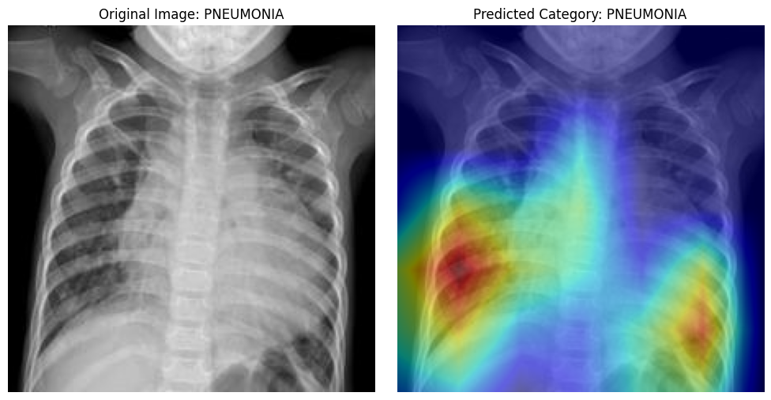
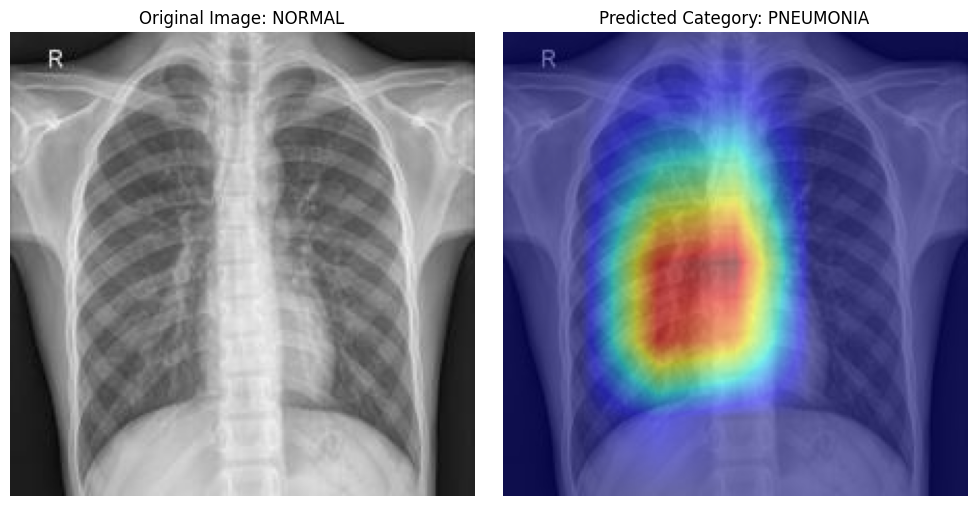
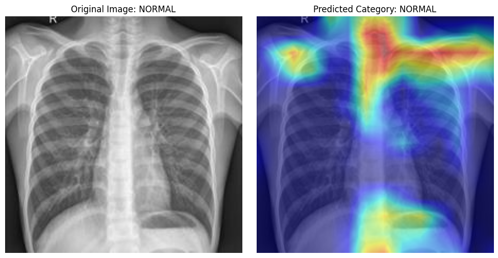

# 🩺 Pneumonia Detection from CXR using Transfer Learning Models


## 📌 Project Overview
This project focuses on developing a deep learning-based system to automatically detect Pneumonia from chest X-ray images. Recognizing the critical importance of early diagnosis in respiratory diseases, especially pneumonia, this project compares the performance of five state-of-the-art convolutional neural network (CNN) architectures to identify the most effective model for accurate detection.

The following models were tested and evaluated:

`DenseNet121` `ConvNeXtBase` `ResNet50V2` `ResNet101V2` `VGG16`

Each model was trained and validated on a labeled dataset of chest X-ray images, designed to distinguish between Normal and Pneumonia-infected cases. By experimenting with multiple architectures, the goal is to identify the most accurate and reliable model for real-world deployment in clinical decision support systems.

The project emphasizes:

- Comparative analysis of model performance

- Evaluation based on accuracy, precision, recall, and F1-score

- Clean codebase with individual notebooks for each model under the src/ directory

The outcome provides valuable insights into the effectiveness of different CNN architectures for medical imaging tasks, specifically pneumonia detection.

## 📂 Dataset

The dataset sourced from Kaggle. To access it click [Chest X-Ray Images (Pneumonia)](https://www.kaggle.com/datasets/paultimothymooney/chest-xray-pneumonia?raw=true)

**Note:** Due to the large size of the dataset, it is **not included in this repository**. Please download the dataset manually from Kaggle and place it in the following structure:

- Classes: `Normal`  `Pneumonia`

- Data Split: `Train` `Test`


## 📁 Project Structure

```bash
📂 Pneumonia-Detection-Project/
├── 📁 src/
│   ├── 📓 ConvNeXtBase_Pneumonia.ipynb
│   ├── 📓 DenseNet121_Pneumonia.ipynb
│   ├── 📓 ResNet50V2_Pneumonia.ipynb
│   ├── 📓 ResNet101V2_Pneumonia.ipynb
│   └── 📓 VGG16_Pneumonia.ipynb
│
├── 📁 data/                     # Dataset not uploaded in repository due to large size
├── 📁 outputs/                  # Results and Visualizations
│
├── 📄 requirements.txt
├── 📄 README.md
└── 📄 LICENCE
```
## 🧾 Requirements

`Python 3.x` `TensorFlow` `Keras` `Matplotlib` `Numpy` `Scikit-learn`
## 📊 Model Performance Comparison

| Model          | Accuracy | F1 Score | Loss   | Precision | Recall  |
|----------------|----------|----------|--------|-----------|---------|
| ConvNeXtBase   | 0.9705   | 0.9544   | 0.0747 | 0.9705    | 0.9705  |
| DenseNet121    | 0.9086   | 0.9285   | 0.3432 | 0.9086    | 0.9086  |
| ResNet50V2     | 0.9537   | 0.9459   | 0.1723 | 0.9537    | 0.9537  |
| ResNet101V2    | 0.9595   | 0.9356   | 0.1784 | 0.9595    | 0.9595  |
| VGG16          | 0.9595   | 0.9192   | 0.1030 | 0.9595    | 0.9595  |

ConvNeXtBase outperforms the others with the highest accuracy and F1 score, indicating strong generalization and precise predictions. DenseNet121 performs well but slightly trails behind ConvNeXtBase, with a good balance between precision and recall. ResNet50V2 offers a strong performance with high precision and recall, making it a reliable choice for detecting pneumonia. ResNet101V2 shows similar performance to ResNet50V2 but with slightly higher accuracy and a better F1 score. VGG16 offers solid results, although it performs slightly lower compared to the other models.

These results demonstrate that while all models perform well, ConvNeXtBase is the top performer for this task.
## 🧩 Confusion Matrices
Confusion Matrix of all 5 tests are included here. Click images for enlarged view.

<p align="left">
  
  
  
  
  
</p>

ConvNeXtBase and VGG16 exhibit more balanced results in comparison to the other models. These models show a better trade-off between correctly identifying 'Pneumonia' cases (True Positives) and minimizing misclassifications (False Positives and False Negatives). DenseNet121, ResNet50V2, and ResNet101V2 demonstrated some imbalance, with either a higher number of False Negatives or False Positives. While these models performed well overall, their results showed a tendency to misclassify 'Pneumonia' cases more frequently than ConvNeXtBase and VGG16. This indicates that ConvNeXtBase and VGG16 have achieved a more reliable and consistent classification performance, making them preferable for deployment in real-world scenarios where accuracy and balanced performance are crucial.

## 🔥 Grad-CAM Visualizations
Some Grad-CAM visualizations are included here. Click images for enlarged view.
<p align="left">
    
    
    
</p>

For model specific visualizations, please refer to .ipynb files.

<a href="https://github.com/ShaikhBorhanUddin/Pneumonia-Detection-Project/blob/main/src/Pneumonia_ConvNeXtBase.ipynb" style="text-decoration: none; margin-right: 8px;">
  <code style="padding: 4px 8px; border-radius: 6px; background: #2d2d2d; color: white;">ConvNeXtBase_Pneumonia.ipynb</code>
</a>
<a href="https://github.com/ShaikhBorhanUddin/Pneumonia-Detection-Project/blob/main/src/Pneumonia_DenseNet121.ipynb" style="text-decoration: none; margin-right: 8px;">
  <code style="padding: 4px 8px; border-radius: 6px; background: #2d2d2d; color: white;">DenseNet121_Pneumonia.ipynb</code>
</a>
<a href="https://github.com/ShaikhBorhanUddin/Pneumonia-Detection-Project/blob/main/src/Pneumonia_ResNet50V2.ipynb" style="text-decoration: none; margin-right: 8px;">
  <code style="padding: 4px 8px; border-radius: 6px; background: #2d2d2d; color: white;">ResNet50V2_Pneumonia.ipynb</code>
</a>
<a href="https://github.com/ShaikhBorhanUddin/Pneumonia-Detection-Project/blob/main/src/Pneumonia_ResNet101V2.ipynb" style="text-decoration: none; margin-right: 8px;">
  <code style="padding: 4px 8px; border-radius: 6px; background: #2d2d2d; color: white;">ResNet101V2_Pneumonia.ipynb</code>
</a>
<a href="https://github.com/ShaikhBorhanUddin/Pneumonia-Detection-Project/blob/main/src/Pneumonia_VGG16.ipynb" style="text-decoration: none;">
  <code style="padding: 4px 8px; border-radius: 6px; background: #2d2d2d; color: white;">VGG16_Pneumonia.ipynb</code>
</a>

###
Due to the dataset imbalance and the 224×224 pixel input size, the model occasionally misclassified normal images as Pneumonia or focused on less relevant regions in the X-rays, with some misclassifications highlighting areas outside the lungs.

## 🚀 Future Development
As future development, the project aims to address dataset imbalance by incorporating more balanced datasets and advanced augmentation techniques, alongside exploring synthetic data generation methods like GANs to enrich the minority class. Model improvements will focus on experimenting with advanced architectures such as EfficientNet or Vision Transformers, fine-tuning hyperparameters, and integrating explainability tools like Grad-CAM++ for deeper insights into model predictions. Additionally, plans include enhancing evaluation with metrics like AUC-ROC and precision-recall curves, implementing experiment tracking tools such as MLflow, and deploying the model as an interactive web application for real-time inference. Collaborations with medical experts for clinical validation are also envisioned to ensure the model's practical relevance and reliability.


## 🤝 Contributing 
Contributions are welcome!
Feel free to fork the project and submit a pull request.

## 📄 License
This project is licensed under the MIT License - see the LICENSE file for details.

## 🙌 Acknowledgements
- ```Paul Mooney``` for the dataset
- TensorFlow / Keras community
- Medical professionals contributing to open datasets

## 🌟 Let's Connect!
If you like this project, please give it a ⭐!
Feel free to connect with me on LinkedIn or check out more of my work on GitHub.
